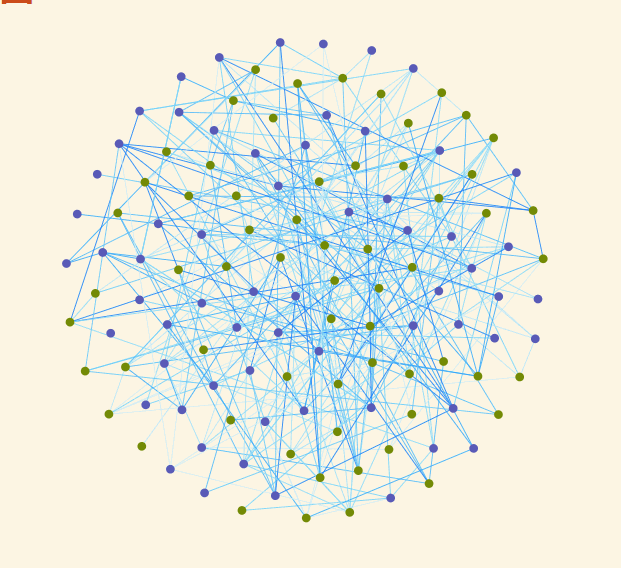
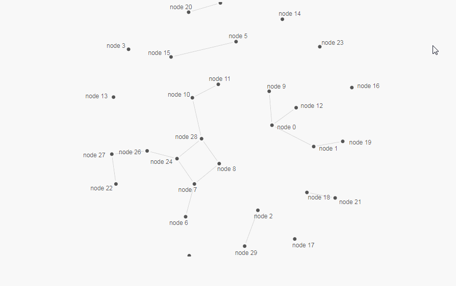

# d3ForceDemo d3力导向图demo

最近项目中可能会用到力导向布局图 于是秋自己写咯个demo 此demo大概实现功能如下：
* 首次页面布局好看（d3自带 这也是吸引我用d3的原因）
* 点的自定义属性
* 点的自定义颜色
* 点的自定义大小
* 点的自定义图片（可实现 此demo未做体现）
* 点的mouseover事件
* 点的mouseout事件
* 点的dblclick事件
* 点的拖拽功能 
* 点的自定义位置 不受力的作用（暂未研究）
* 点的自定义文字
* 点的文字hover控制功能
* 线的自定义颜色
* 线的自定义粗细
* 线的自定义属性
* 线的箭头及其它形形状（可实现 此demo未做体现）
* 线的流动性样式（未做研究）
* 虚线（未做研究）
* 曲线（未做研究）
* 拆线（未做研究）
* 贝塞尔曲线（未做研究）
* 线的mouseover事件
* 线的mouseout事件
* 线的dblclick事件
* 线的自定义文字
* 根据连线值的大小渲染连线颜色的深浅功能
* 双击点增加新点并与之相连的功能
* 清除所有的点线功能
* 鼠标缩放画布功能
* 鼠标拖动画布功能
* 画布自适应浏览器大小重载功能（暂未实现）
* 鹰眼功能（暂未实现）

初次出现：

双击点的钻取功能：

效果如下：

 ### 我最终想实现的效果如下
 
 
 ### demo1
 
 
 ### demo2
 
 
 ### demo3
 

[我一哥们的threeTestdemo](https://doter1995.github.io/three/threeTest/)

[我一哥们做的d3增加点的功能](https://doter1995.github.io/d3/charts/force.html)

[然后是这哥们吹牛* 的主页](https://doter1995.github.io/)
