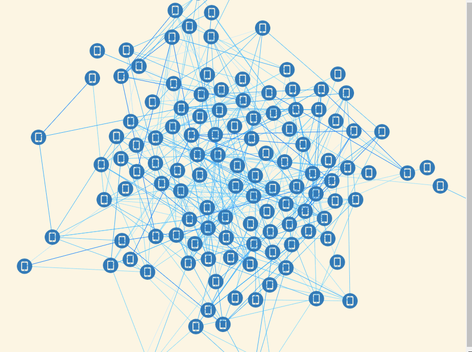

# d3ForceDemo d3力导向图

最近项目中可能会用到力导向布局图 于是自己写咯个demo 此demo大概实现功能如下：
 * 需要实现的功能：
 * 1、首次页面布局好看（d3自带 这也是吸引我用d3的原因）实现
 * 2、点的自定义属性 实现
 * 3、点的自定义颜色 实现
 * 4、点的自定义大小 实现
 * 5、点的自定义图片（可实现 此demo未做体现）
 * 6、点的mouseover事件 实现
 * 7、点的mouseout事件 实现
 * 8、点的dblclick事件 实现
 * 9、点的mousedown事件 实现
 * 10、点的mouseup事件 实现
 * 11、点的click事件 实现
 * 12、点的拖拽功能 实现
 * 13、点的增加功能 实现
 * 14、点的删除功能 实现
 * 15、点的更改功能
 * 16、点的查找功能
 * 17、点的自定义位置 不受力的作用 实现
 * 18、点的自定义文字 实现
 * 19、线的自定义颜色 实现
 * 20、线的自定义粗细 实现
 * 21、线的自定义属性 实现
 * 22、线的箭头及其它形形状（可实现 此demo未做体现）
 * 23、线的流动性样式（未做研究）
 * 24、虚线（未做研究）
 * 25、曲线（未做研究）
 * 26、拆线（未做研究）
 * 27、贝塞尔曲线（未做研究）
 * 28、线的mouseover事件 实现
 * 29、线的mouseout事件 实现
 * 30、线的dblclick事件 实现
 * 31、线的mousedown事件 实现
 * 32、线的mouseup事件 实现
 * 33、线的click事件 实现
 * 34、线的自定义文字 实现
 * 35、线的增加功能
 * 36、线的删除功能 删除点的时候删除 实现
 * 37、线的更改功能
 * 38、线的查找功能
 * 38、根据连线值的大小渲染连线颜色的深浅功能 实现
 * 40、双击点增加新点并与之相连的功能 实现
 * 41、清除所有的点线功能 完成
 * 42、鼠标缩放画布功能 完成
 * 43、鼠标拖动画布功能 完成
 * 44、拖动以及缩放画布后居中和还原缩放的功能（暂未实现）
 * 45、画布自适应浏览器大小变化重载功能（暂未实现）
 * 46、自定义点的位置并实现中心点吸引画圆功能 实现
 * 47、鹰眼功能（暂未实现）
 * 48、显示隐藏所有的node文字
 * 49、显示隐藏所有的line文字
 * 50、缩放设定范围 完成
 * 51、点可以更换成图片 已实现功能 未封装成API
 * 52、框选删除 暂未实现
 *
 * 目前还差两功能未实现：
 * 1、连线颜色根据值的大小渲染深浅 完成
 * 2、点的删除功能 完成
 * 3、点可以更换成图片 完成 
 * 4、点按住ctrol键加click可以选择多个 并可以通过delet键删除
 * 5、框选删除

初次出现：

双击点的钻取功能：

[我一哥们的threeTestdemo](https://doter1995.github.io/three/threeTest/)

[我一哥们做的d3增加点的功能](https://doter1995.github.io/d3/charts/force.html)

[然后是这哥们吹牛* 的主页](https://doter1995.github.io/)

[这哥们的博客值得一读关于d3力导向图的](https://blog.csdn.net/lzwdfas/article/details/60466566)

https://blog.csdn.net/tengxing007/article/details/59712572

https://github.com/tianxuzhang/d3.v4-API-Translation#hierarchies
